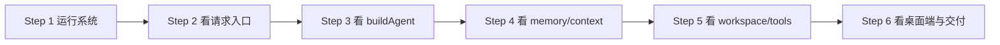
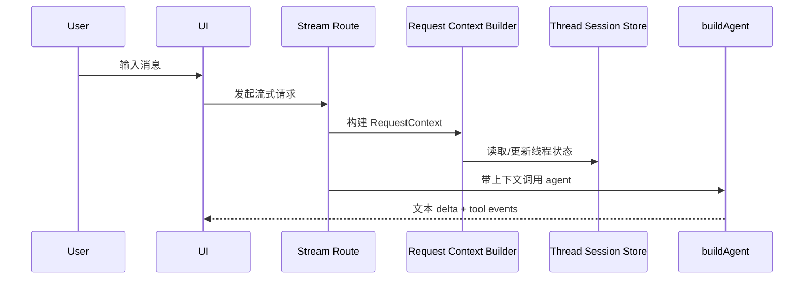
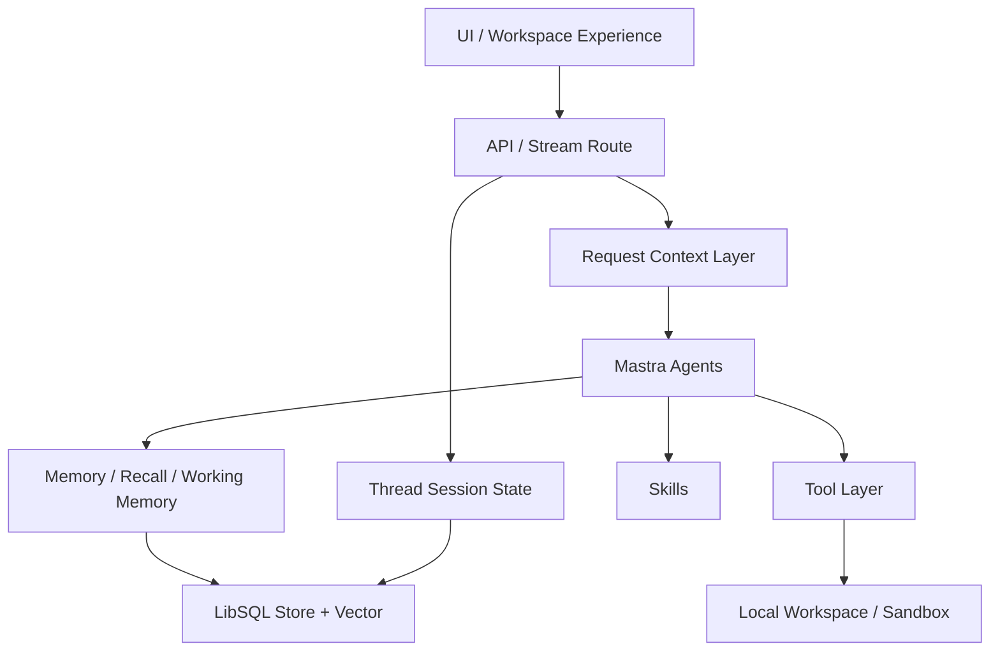

# Rovix Developer README

这份 README 面向开发者，不是产品介绍页。

目标只有一个：**帮助你快速学会这套 Mastra coding agent 的结构、运行方式、关键设计决策，以及如何继续开发它。**

如果你是第一次进入这个仓库，建议把这份文档当成一张学习地图来读。

## 你将学到什么

读完这份 README，你应该能回答下面这些问题：

- 这套系统由哪些层组成
- 用户一次输入是如何进入 Mastra agent 的
- memory、working memory、semantic recall 分别在做什么
- workspace 和 tools 为什么是这套 coding agent 的核心
- context compaction 为什么存在，以及它怎么工作
- 如果你要加一个新 tool、一个新 skill、一个新 agent，该从哪里下手

## 先建立正确心智模型

这不是一个“聊天 UI + 大模型 API”的简单项目。

它更接近一套本地执行型 coding agent runtime：

- UI 负责承接用户意图和展示流式执行状态
- API 层负责把用户输入加工成可执行的 agent request
- Mastra 负责 agent、memory、tool orchestration、skills 和 storage
- Workspace 负责把 agent 绑定到本地项目现场
- Tools 负责真正执行文件、命令、浏览器、任务委托等动作
- Thread session 负责让一次长任务可以跨多轮持续推进

建议你把它理解成：

**一个带产品外壳的本地 AI 编程执行系统。**

## 学习顺序

不要从头到尾平铺看代码。推荐按下面顺序学习。



### Step 1. 先跑起来

先不要急着深挖代码，先感受系统行为。

安装依赖：

```bash
bun install
```

启动 Web：

```bash
bun run dev
```

如果你要联调桌面端：

```bash
bun run dev:desktop
bun run desktop:dev
```

你在这一步要观察的重点：

- 发一条消息后，前端如何开始流式输出
- 工具调用是如何展示的
- 长任务和普通问答在体验上有什么不同
- 线程切换后，为什么上下文还能延续

### Step 2. 看请求入口

先理解“一条消息如何进入系统”。

优先阅读：

- [app/api/agents/[agentId]/stream/route.ts](/Users/work/coding-agent/app/api/agents/[agentId]/stream/route.ts)
- [lib/server/agent-request-context.ts](/Users/work/coding-agent/lib/server/agent-request-context.ts)
- [lib/server/thread-session-store.ts](/Users/work/coding-agent/lib/server/thread-session-store.ts)

你要重点理解：

- 前端传来的 `message`、`messages`、`threadId`、`model` 是怎么被处理的
- `RequestContext` 是怎么构建出来的
- `workspaceRoot` 是怎么恢复和绑定到线程的
- thread session 为什么要单独维护
- stream route 为什么不仅返回文本，还返回 tool events、usage、context state

看到这里时，你应该已经能画出这条链路：



### Step 3. 看主 Agent

接下来进入系统核心。

优先阅读：

- [mastra/index.ts](/Users/work/coding-agent/mastra/index.ts)
- [mastra/agents/build-agent.ts](/Users/work/coding-agent/mastra/agents/build-agent.ts)
- [mastra/agents/prompts/build-prompts.ts](/Users/work/coding-agent/mastra/agents/prompts/build-prompts.ts)
- [mastra/agents/processors/continuation-processor.ts](/Users/work/coding-agent/mastra/agents/processors/continuation-processor.ts)

这里最重要的不是语法，而是角色划分：

- `buildAgent` 是主执行 agent
- instructions 会根据模型和上下文动态拼装
- input processors 会在模型真正执行前加工输入
- tools 是 agent 的动作边界
- memory 让 agent 不只看当前一轮

你要理解的核心问题：

- 为什么这里把 runtime directives 写进 instructions
- 为什么 `TokenLimiterProcessor` 和 `SkillSearchProcessor` 要放在输入阶段
- 为什么这个 agent 明显偏执行，不偏闲聊
- 为什么 request context 对 agent 行为影响这么大

## 系统分层

下面这张图是开发时最有用的总览图。



开发时请始终记住这 8 个层次：

1. UI 层
2. API 层
3. Request Context 层
4. Agent 层
5. Memory 层
6. Tool 层
7. Workspace 层
8. Storage / Thread State 层

## 各层该怎么学

### 1. UI 层

先看这些文件：

- [app/[id]/page.tsx](/Users/work/coding-agent/app/[id]/page.tsx)
- [components](/Users/work/coding-agent/components)
- [lib/stream-event-bus.ts](/Users/work/coding-agent/lib/stream-event-bus.ts)

你要学的是：

- UI 如何承接 agent stream
- tool 事件如何转成用户可感知的执行过程
- 为什么 coding agent 的 UI 必须展示过程，而不只是展示最终答案

### 2. API / 编排层

先看这些文件：

- [app/api/agents/[agentId]/stream/route.ts](/Users/work/coding-agent/app/api/agents/[agentId]/stream/route.ts)
- [lib/server/agent-request-context.ts](/Users/work/coding-agent/lib/server/agent-request-context.ts)
- [lib/server/thread-session-store.ts](/Users/work/coding-agent/lib/server/thread-session-store.ts)

你要学的是：

- 如何把“用户输入”变成“agent 能理解的运行态”
- continuation、guide、image-analysis 这些模式是如何被推断出来的
- thread state 为什么是 coding agent 中的第一等公民

### 3. Agent 层

先看这些文件：

- [mastra/index.ts](/Users/work/coding-agent/mastra/index.ts)
- [mastra/agents/build-agent.ts](/Users/work/coding-agent/mastra/agents/build-agent.ts)
- [mastra/agents/context-agent.ts](/Users/work/coding-agent/mastra/agents/context-agent.ts)
- [mastra/agents/prompts](/Users/work/coding-agent/mastra/agents/prompts)

你要学的是：

- 主 agent 和辅助 agent 的职责划分
- instruction engineering 在这个项目里不是 prompt 美化，而是 runtime policy
- model 选择、tool 使用约束、continuation 策略如何通过 instructions 落地

### 4. Memory / Context 层

先看这些文件：

- [mastra/memory.ts](/Users/work/coding-agent/mastra/memory.ts)
- [lib/context-window.ts](/Users/work/coding-agent/lib/context-window.ts)
- [lib/server/context-compaction.ts](/Users/work/coding-agent/lib/server/context-compaction.ts)

你要学的是：

- `lastMessages`、`semanticRecall`、`workingMemory` 的分工
- 为什么 coding agent 不能只靠“把所有消息都丢给模型”
- 上下文预算如何随模型变化
- compact / critical 状态下系统如何降级

### 5. Workspace / Tool 层

先看这些文件：

- [mastra/workspace/local-workspace.ts](/Users/work/coding-agent/mastra/workspace/local-workspace.ts)
- [mastra/tools/index.ts](/Users/work/coding-agent/mastra/tools/index.ts)
- [mastra/tools/exec-command.tool.ts](/Users/work/coding-agent/mastra/tools/exec-command.tool.ts)
- [mastra/tools/local-process-manager.ts](/Users/work/coding-agent/mastra/tools/local-process-manager.ts)
- [mastra/tools/browser-open.tool.ts](/Users/work/coding-agent/mastra/tools/browser-open.tool.ts)

你要学的是：

- 为什么 agent 真正的能力边界不在 model，而在 tools
- workspace 如何给 tools 划边界
- 长命令执行为什么要做 session 化
- 浏览器工具为什么要保留 session，而不是一步一开

### 6. Skills 层

先看这些文件：

- [mastra/skills/index.ts](/Users/work/coding-agent/mastra/skills/index.ts)
- [mastra/skills/registry.ts](/Users/work/coding-agent/mastra/skills/registry.ts)

你要学的是：

- skill discovery 是怎么做的
- 为什么要同时支持 workspace skills 和 user skills
- 提及式 skill loading 为什么很重要

### 7. Storage 层

先看这些文件：

- [mastra/storage.ts](/Users/work/coding-agent/mastra/storage.ts)
- [lib/server/thread-session-store.ts](/Users/work/coding-agent/lib/server/thread-session-store.ts)

你要学的是：

- thread、memory、vector 为什么放在同一类持久化体系里
- 本地数据库为什么适合这种产品形态
- 哪些状态是 Mastra memory，哪些状态是 thread session metadata

### 8. Desktop / Delivery 层

先看这些文件：

- [src-tauri](/Users/work/coding-agent/src-tauri)
- [scripts/release.mjs](/Users/work/coding-agent/scripts/release.mjs)
- [.github/workflows/release.yml](/Users/work/coding-agent/.github/workflows/release.yml)

你要学的是：

- Web 工作台如何被包装成桌面应用
- 自动更新为什么属于产品闭环的一部分
- 工程交付和 AI 编排为什么要一起设计

## 源码地图

如果你时间有限，只看下面这些文件也能抓住主干：

- [app/api/agents/[agentId]/stream/route.ts](/Users/work/coding-agent/app/api/agents/[agentId]/stream/route.ts)
- [lib/server/agent-request-context.ts](/Users/work/coding-agent/lib/server/agent-request-context.ts)
- [mastra/agents/build-agent.ts](/Users/work/coding-agent/mastra/agents/build-agent.ts)
- [mastra/memory.ts](/Users/work/coding-agent/mastra/memory.ts)
- [lib/server/context-compaction.ts](/Users/work/coding-agent/lib/server/context-compaction.ts)
- [mastra/workspace/local-workspace.ts](/Users/work/coding-agent/mastra/workspace/local-workspace.ts)
- [mastra/tools/index.ts](/Users/work/coding-agent/mastra/tools/index.ts)
- [mastra/storage.ts](/Users/work/coding-agent/mastra/storage.ts)

## 开发练习建议

最好的学习方式不是读完，而是边读边改。

建议按下面顺序做练习。

### 练习 1. 改一个 tool 的描述文本

目标：

- 熟悉 tool catalog
- 理解 tool 描述为什么会影响 agent 决策

建议入口：

- [mastra/tools/text](/Users/work/coding-agent/mastra/tools/text)
- [mastra/tools/index.ts](/Users/work/coding-agent/mastra/tools/index.ts)

### 练习 2. 新增一个只读工具

目标：

- 学会 tool 的定义、导出、挂载链路

建议步骤：

1. 在 `mastra/tools/` 下新增一个简单工具
2. 在 `mastra/tools/index.ts` 导出
3. 在 `mastra/agents/build-agent.ts` 挂到 `staticTools`
4. 本地发起请求，观察 agent 是否会调用它

### 练习 3. 调整 working memory 模板

目标：

- 理解 working memory 对执行型 agent 的影响

建议入口：

- [mastra/memory.ts](/Users/work/coding-agent/mastra/memory.ts)
- [lib/server/context-compaction.ts](/Users/work/coding-agent/lib/server/context-compaction.ts)

### 练习 4. 调整 context budget

目标：

- 理解上下文压力与线程续航

建议入口：

- [lib/context-window.ts](/Users/work/coding-agent/lib/context-window.ts)

### 练习 5. 新增一个 workspace skill

目标：

- 理解 skill discovery、skill loading 和 runtime instruction 注入

建议入口：

- [mastra/skills/registry.ts](/Users/work/coding-agent/mastra/skills/registry.ts)

## 扩展指南

### 如果你要加一个新 Tool

一般路径是：

1. 在 `mastra/tools/` 新建工具实现
2. 在 `mastra/tools/index.ts` 导出
3. 在 `mastra/agents/build-agent.ts` 注册到 `staticTools`
4. 必要时补充 tool 描述文本
5. 在真实线程里验证 agent 是否会正确选择这个工具

### 如果你要加一个新 Skill

一般路径是：

1. 在 workspace 或用户 skill 目录增加 `SKILL.md`
2. 确保 metadata 可被发现
3. 验证 mention loading 是否生效
4. 观察 request context 是否成功注入技能说明

### 如果你要改 Agent 行为

优先看三处：

- `mastra/agents/build-agent.ts`
- `mastra/agents/prompts/`
- `lib/server/agent-request-context.ts`

不要只改 prompt。

这个项目里 agent 行为通常由 3 类东西共同决定：

- instructions
- request context
- available tools

### 如果你要提升长任务表现

优先看三处：

- `mastra/memory.ts`
- `lib/context-window.ts`
- `lib/server/context-compaction.ts`

因为长任务能力本质上来自：

- message 保留策略
- recall 策略
- summary 策略
- thread state 持久化

## 设计上最值得你注意的 6 个点

### 1. Request Context 比 Prompt 更像操作系统

真正决定 agent 当前“身处什么环境”的，不是用户这句输入本身，而是 request context。

### 2. Workspace 是 coding agent 的现实边界

没有 workspace，agent 只是会说话；有了 workspace，它才算能对真实项目做事。

### 3. Tools 才是能力接口

模型负责决策，tools 负责落地，所以工程质量很大程度取决于工具设计。

### 4. Thread State 是长任务的基础设施

没有 thread state，就很难真正支持“继续刚才那个任务”。

### 5. Context Compaction 是产品能力，不只是优化项

如果没有 compaction，长线程会迅速失控。

### 6. UI 必须展示执行过程

coding agent 不是问答机器人，用户必须看到系统正在读什么、做什么、卡在哪。

## 环境变量

当前主链路最小配置：

```env
OPENROUTER_API_KEY=...
MODEL=openrouter/openai/gpt-5.4-nano
```

## 建议下一步文档化的内容

如果你准备继续把开发者体验做扎实，推荐继续拆出这些文档：

- `docs/architecture/request-lifecycle.md`
- `docs/architecture/memory-and-context.md`
- `docs/architecture/workspace-and-tools.md`
- `docs/guides/add-a-tool.md`
- `docs/guides/add-a-skill.md`

## 一句话总结

对于开发者来说，这个仓库最值得学的，不是“怎么接一个模型”，而是：

**怎么把 agent、memory、workspace、tool runtime、thread continuity 和产品外壳真正拼成一个可持续工作的 coding agent 系统。**
