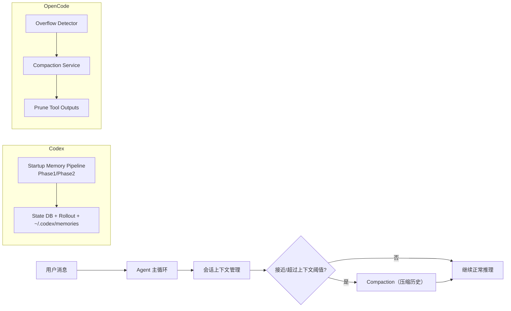

# Submodule 深度文档：Codex vs OpenCode（上下文压缩 / 记忆 / 会话持久化）

本文基于当前仓库的两个 Git submodule 实现进行源码级说明：

- `codex`：`cca36c5681d16c7dac6e3f385589b8cd4d3e78cd`
- `opencode`：`00fa68b3a70facfe942523d35e2ecbf8456f0d49`

目标是回答三个核心问题：

1. 两者是否有“上下文压缩（compaction）”，怎么触发、怎么执行？
2. 两者是否有“memory（长期/跨会话记忆）”，存在哪、如何更新？
3. 在你这个仓库里（Mastra + Next API）到底接了哪一层，为什么日志表现会和上游不一样？

---

## 1. 一句话结论（先给决策结论）

- `Codex`：有两套机制并行存在  
  - 会话内上下文压缩（`compact`）：为避免超 context window，自动/手动触发，压缩历史为 summary 并替换历史。  
  - 启动期 memory pipeline（Phase1/Phase2）：从历史 rollout 萃取结构化 memory，落到 `~/.codex/memories` 和 state DB。
- `OpenCode`：核心是会话级 compaction + overflow 控制  
  - 自动 overflow 检测（基于 token + reserved buffer）  
  - compaction agent 生成“可续跑总结”  
  - 可选 prune 老 tool output  
  - 有手动 API：`POST /project/:projectID/session/:sessionID/compact`
- 你当前仓库主运行链路是 **Mastra 自身 memory（thread recall + working memory）**，不是直接运行 codex-rs 的 memory pipeline。

---

## 2. 架构总览

---

## 3. Codex 子模块详解

### 3.1 会话内 compaction（上下文压缩）

关键源码：

- `codex/codex-rs/core/src/codex.rs`（`run_pre_sampling_compact`）
- `codex/codex-rs/core/src/compact.rs`
- `codex/codex-rs/core/src/compact_remote.rs`
- `codex/codex-rs/core/src/context_manager/history.rs`
- `codex/codex-rs/core/src/config/mod.rs`（`model_auto_compact_token_limit`）

#### 触发逻辑

`run_pre_sampling_compact` 会在采样前检查 `total_usage_tokens`，若达到模型自动压缩阈值则执行 compaction：

- 阈值读取：`model_info.auto_compact_token_limit()`（最终来自配置 `model_auto_compact_token_limit`）
- 判断：`total_usage_tokens >= auto_compact_limit` 即触发

另外有“模型切换到更小 context window”时的预压缩逻辑：

- `maybe_run_previous_model_inline_compact` 会比较旧模型与新模型 context window  
- 若旧窗口更大且当前总 token 已超新模型阈值，会先按旧模型做一次 inline compact

#### 执行逻辑

`compact.rs` 的核心流程：

1. 创建 `ContextCompactionItem`（turn item）
2. 复制历史并调用模型生成 summary（有重试与错误分支）
3. 若 context 超限，按“从最旧项开始移除”逐步缩短输入（保留最新对话）
4. 生成 replacement history（summary + 用户消息骨架）
5. 写回 `replace_compacted_history(...)`
6. 重新计算 token usage 并发出 warning

其中 `InitialContextInjection` 机制很关键：

- `DoNotInject`：预轮次/手动 compact，清空 baseline，下一轮完整注入初始上下文
- `BeforeLastUserMessage`：中途 compact，保持模型训练预期顺序（summary 保持在最后）

### 3.2 ContextManager 的 token 估算与历史规范化

关键源码：`codex/codex-rs/core/src/context_manager/history.rs`

能力包括：

- 保存历史 `ResponseItem`（只保留 API 可见消息）
- `estimate_token_count(...)` 做粗粒度 token 估算
- `get_total_token_usage(...)` 结合上次 API usage 和增量历史估算
- `normalize_history(...)` 保证 call/output 成对，清理 orphan，按模型模态剥离不支持图像
- 提供 `remove_first_item()` / rollback 相关能力，支撑 compact 和恢复流程

这解释了一个现象：Codex 的“超限控制”不是单一开关，而是“估算 + 正规化 + compact 写回”的组合。

### 3.3 Codex 的 memory（不是同一件事）

关键源码：

- `codex/codex-rs/core/src/memories/README.md`
- `codex/codex-rs/core/src/memories/mod.rs`
- `codex/codex-rs/core/src/memories/start.rs`
- `codex/codex-rs/state/src/runtime/memories.rs`
- `codex/codex-rs/state/src/model/memories.rs`

这个 memory 是“启动期后台 pipeline”，和会话内 compaction 区分开：

- Phase1：对历史 rollout 做抽取，生成 `raw_memory` / `rollout_summary`
- Phase2：全局 consolidation，更新 memory artifacts 并触发 consolidation agent

启动条件（`start_memories_startup_task`）：

- 非 ephemeral
- feature flag 开启（`Feature::MemoryTool`）
- 不是 sub-agent session
- state DB 可用

默认模型（`memories/mod.rs`）：

- Phase1：`gpt-5.4-mini`
- Phase2：`gpt-5.3-codex`

### 3.4 Codex 持久化层（状态/表结构）

关键迁移：

- `state/migrations/0001_threads.sql`：`threads` 主表
- `state/migrations/0006_memories.sql`：`stage1_outputs` 与 `jobs`（memory pipeline作业）
- `state/migrations/0016_memory_usage.sql`：`usage_count` / `last_usage`
- `state/migrations/0018_phase2_selection_snapshot.sql`：`threads.memory_mode`（默认 `enabled`）

你可以把它理解成：

- `threads`：会话元数据与 token 累计
- `stage1_outputs`：每线程 memory 抽取结果
- `jobs`：stage1/phase2 的租约、重试、水位线
- `memory_mode`：线程级 memory 状态（enabled/disabled/polluted 等流程态）

### 3.5 文件系统层

来自 `codex-rs/README.md` 与 `memories/mod.rs`：

- `~/.codex/memories` 是 memory 产物根目录（workspace-write 下也被纳入可写）
- rollout 与 state DB 协同管理（`rollout` 模块 + `state` 模块）

---

## 4. OpenCode 子模块详解

### 4.1 Overflow 检测（自动压缩前置条件）

关键源码：`opencode/packages/opencode/src/session/overflow.ts`

核心逻辑（`isOverflow`）：

- 若 `cfg.compaction.auto === false`，直接不触发
- 读取模型 context limit 与 token 计数
- 计算 `reserved` buffer：
  - 优先用 `cfg.compaction.reserved`
  - 否则 `min(20000, model.maxOutputTokens)`
- 计算可用输入预算 `usable`
- 当 `count >= usable` 视为 overflow

这套机制的特点是：**为 compaction 和输出留“保命 buffer”**，避免临界状态再次溢出。

### 4.2 Compaction 服务主流程

关键源码：`opencode/packages/opencode/src/session/compaction.ts`

提供能力：

- `isOverflow(...)`
- `prune(...)`
- `process(...)`
- `create(...)`

`process` 关键点：

- 必须有 user parent message
- overflow 场景会尝试选择“可回放的上一条用户输入”（`replay`）
- 调用 `compaction` agent 生成续跑摘要（默认 prompt 模板在代码内）
- 插件可注入 context 或覆盖 compaction prompt（`experimental.session.compacting`）
- 成功后可自动合成继续执行消息（auto continue）
- 发出 `session.compacted` 事件

### 4.3 Prune 机制（清理老 tool output）

同文件内 `prune(...)`：

- 从新到旧回溯 tool completed part，累积 token 估算
- 保护最近一段（`PRUNE_PROTECT = 40_000`）
- 仅当待裁剪总量超阈值（`PRUNE_MINIMUM = 20_000`）才真正裁剪
- `skill` 在 `PRUNE_PROTECTED_TOOLS` 中，默认受保护

这意味着 OpenCode 不是“只做 summary compact”，还会做 tool 输出生命周期管理。

### 4.4 OpenCode 配置面

关键源码：`opencode/packages/opencode/src/config/config.ts`

`compaction` 配置项：

- `auto`：是否自动 compact（默认 true）
- `prune`：是否允许 prune（默认 true）
- `reserved`：预留 token 缓冲

兼容开关：

- `OPENCODE_DISABLE_AUTOCOMPACT` -> 关闭 auto compact
- `OPENCODE_DISABLE_PRUNE` -> 关闭 prune

### 4.5 OpenCode API 能力

关键文档：`opencode/specs/project.md`

明确有手动 compact 接口：

- `POST /project/:projectID/session/:sessionID/compact`

---

## 5. Codex vs OpenCode 对比矩阵（核心差异）

| 维度 | Codex | OpenCode |
| --- | --- | --- |
| 会话内压缩触发 | `total_usage_tokens >= auto_compact_limit`（预采样） | `isOverflow`（count vs usable+reserved） |
| 压缩执行 | inline/remote compact，替换历史 + summary | compaction agent + 可 replay + auto continue |
| 失败回退 | 逐步移除最旧历史项、重试、错误事件 | 返回 `stop` / `compact` 错误态，保留会话一致性 |
| tool 输出治理 | 历史规范化与截断为主 | 显式 `prune` 老 tool output |
| 手动 compact | 有 `/compact` 路径与任务支持（内部命令流） | 明确 HTTP API：`POST .../compact` |
| memory（跨会话） | 有启动期 Phase1/2 pipeline + stateDB + filesystem artifacts | 本层核心不强调独立 memory pipeline（重点在 session compaction） |
| 持久化中心 | rollout + state DB + `~/.codex/memories` | session/project 存储 + compaction 生命周期 |

---

## 6. 你当前仓库的“真实接线”说明（最容易混淆）

你仓库并不是直接把 codex-rs/opencode 原封装到前端，而是有一层 Mastra 编排：

关键文件：

- `mastra/agents/build-agent.ts`
- `mastra/memory.ts`
- `mastra/storage.ts`
- `app/api/agents/[agentId]/stream/route.ts`
- `lib/server/thread-session-store.ts`

### 6.1 你现在实际在跑的 memory

`mastra/memory.ts`：

- `lastMessages: 20`
- `semanticRecall.topK: 3`
- `scope: "thread"`
- working memory 模板（thread 范围）

这说明你运行态主要使用的是 **Mastra Memory**，不是 codex-rs 的启动 memory pipeline。

### 6.2 Thread 与 storage 落盘

`mastra/storage.ts`：

- 默认 DB：`~/.coding-agent/mastra.db`（可被 `MASTRA_STORAGE_*` 覆盖）
- 同时用于 store 和 vector

`thread-session-store.ts`：

- 线程元数据写到 mastra memory store，`metadata.codex` 下挂 UI/会话状态
- 资源标识固定为 `resourceId = "web"`

### 6.3 Stream 请求里的 memory 注入

`app/api/agents/[agentId]/stream/route.ts`：

- 若请求没显式给 `memory` 但有 `threadId`，会自动注入：
  - `thread: { id: payload.threadId }`
  - `resource: "web"`
- 然后传给 `agent.stream(..., { memory })`

这就是为什么你日志里“看着是 Build Agent”，但工具集/行为会受 Mastra runtime + request context + memory 注入策略共同影响。

---

## 7. 为什么你会感觉“有 compaction / memory，但行为不一致”

常见原因有三类：

1. 名词重叠但层级不同  
   - Codex 的 memory pipeline（启动后台）  
   - Mastra 的 memory（每次请求检索上下文）  
   - OpenCode 的 compaction（会话历史压缩）
2. 触发条件不同  
   - Codex 看 total usage 与 auto compact limit  
   - OpenCode 看 overflow + reserved buffer
3. 你当前产品链路实际走的是 Mastra Agent 层，而不是直接执行 submodule CLI/TUI 的全部行为

---

## 8. 落地建议（给你的项目）

如果你要“行为更像 OpenCode/Codex 原生体验”，建议按优先级做：

1. 先明确唯一主机制  
   - 只保留一种“会话内压缩决策入口”（Mastra 入口层统一判定）
2. 把 compaction 事件标准化  
   - 统一事件：触发原因、阈值、裁剪量、摘要长度、是否 replay
3. 区分短期记忆与长期记忆  
   - 短期：Mastra thread recall  
   - 长期：单独 pipeline（可借鉴 codex Phase1/2）
4. 做可观测性面板  
   - 当前 token、阈值、reserved、是否 overflow、最近一次 compact 时刻与结果

---

## 9. 速查索引（方便继续深入）

Codex：

- `codex/codex-rs/core/src/codex.rs`
- `codex/codex-rs/core/src/compact.rs`
- `codex/codex-rs/core/src/compact_remote.rs`
- `codex/codex-rs/core/src/context_manager/history.rs`
- `codex/codex-rs/core/src/memories/README.md`
- `codex/codex-rs/core/src/memories/mod.rs`
- `codex/codex-rs/core/src/memories/start.rs`
- `codex/codex-rs/state/src/runtime/memories.rs`
- `codex/codex-rs/state/migrations/0006_memories.sql`
- `codex/codex-rs/state/migrations/0016_memory_usage.sql`
- `codex/codex-rs/state/migrations/0018_phase2_selection_snapshot.sql`

OpenCode：

- `opencode/packages/opencode/src/session/overflow.ts`
- `opencode/packages/opencode/src/session/compaction.ts`
- `opencode/packages/opencode/src/config/config.ts`
- `opencode/specs/project.md`

本仓库接线层：

- `mastra/agents/build-agent.ts`
- `mastra/memory.ts`
- `mastra/storage.ts`
- `app/api/agents/[agentId]/stream/route.ts`
- `lib/server/thread-session-store.ts`

